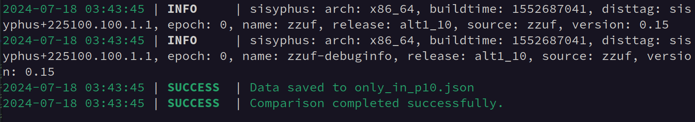
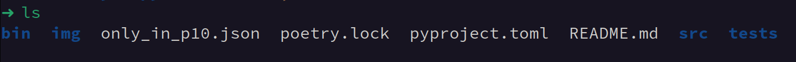
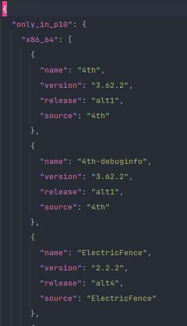
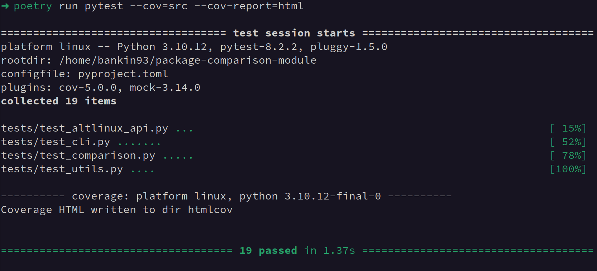
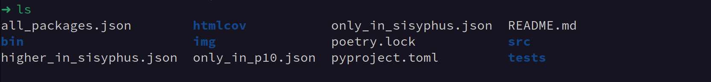
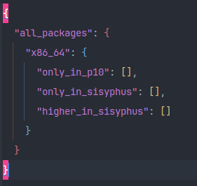
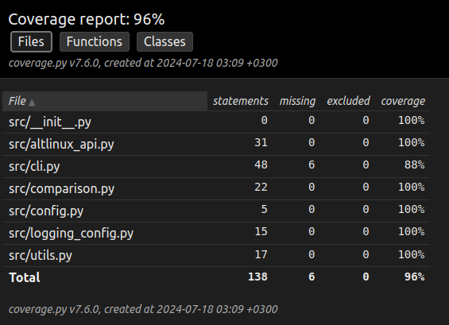

# Package Comparison Module

## Overview

The Package Comparison Module is a Python tool and CLI utility designed for comparing binary packages between two branches of ALT Linux: sisyphus and p10. It fetches package lists from a public REST API, performs comparisons, and generates a JSON report detailing differences between the branches.

## Features

- Fetch lists of binary packages for the `sisyphus` and `p10` branches.
- Compare the package lists and generate a JSON output with:
  - Packages only in `p10`.
  - Packages only in `sisyphus`.
  - Packages with higher `version-release` in `sisyphus` than in `p10`.

## Technology Stack

- **Python 3.10**: The programming language used for the module and CLI tool.
- **Poetry**: Dependency management and packaging tool.
- **Requests**: Library for making HTTP requests to interact with the ALT Linux API.
- **Loguru**: Logging library for better log management.
- **TQDM**: Progress bar library for providing visual feedback during long operations.
- **Pytest**: Testing framework for writing and running tests.
- **Version-Utils**: Utility for version comparison.
- **Black**: Code formatter for maintaining code style.

## Code Structure

### src/

- **altlinux_api.py**: Module for interacting with the ALT Linux API.
- **cli.py**: Command-line interface using argparse for user input handling.
- **comparison.py**: Module for comparing package lists and generating comparison results.
- **config.py**: Configuration settings for the project.
- **logging_config.py**: Logging configuration setup using Loguru for enhanced logging capabilities.
- **utils.py**: Utility functions used across different modules.

### bin/

- **compare_packages.py**: Executable script for running package comparison.

### tests/

- **__init__.py**: Initialization file to mark directory as a Python package.
- **test_altlinux_api.py**: Tests for the ALT Linux API interaction.
- **test_cli.py**: Tests for the CLI functionality using pytest.
- **test_comparison.py**: Tests for package comparison logic.
- **test_utils.py**: Tests for utility functions.

## Installation

1. Clone the repository:
    ```sh
    git clone git@github.com:igorkonov/package-comparison-module.git
    cd package-comparison-module
    ```

2. Install dependencies using Poetry:
    ```sh
    poetry install
    ```
## CLI Usage

The CLI tool `compare_packages` allows you to compare binary packages between `sisyphus` and `p10` branches of ALT Linux.
## Command-Line Options
    
```sh
poetry run compare-packages -h
```
usage: compare_packages [-a `<arch>`] [-o `<output_file>`]

Compare binary packages between sisyphus and p10 branches.

options:
- `-h, --help`: Show this help message and exit
- `-a, --arch`: Specify the architecture to compare (`x86_64`, `ppc64le`, `i586`, `armh`, `aarch64`).
- `-o, --output`: Specify the output JSON file to save (`only_in_p10`, `only_in_sisyphus`, `higher_in_sisyphus`, `all_packages`). Default is `all_packages`.

Example usage:
```sh
poetry run compare_packages -a x86_64 -o only_in_p10
```
This command fetches package data for `x86_64` architecture, compares the packages between `sisyphus` and `p10`, and saves the result to `only_in_p10.json`.


Alternatively, if you have activated the virtual environment using `poetry shell`, you can directly run:
```sh
compare_packages -a x86_64 -o only_in_p10
```


The tool will fetch the package data, perform the comparison, and output the result in JSON format:







## Running Tests

To run the tests, use the following command:
```sh
poetry run pytest --cov=src --cov-report=html
```
This will run all the tests and generate a coverage report in HTML format.



Tests creates and overwrites the result JSON files:





Test Coverage:



## Authors

- **[igorkonov](https://github.com/igorkonov)** — project developer