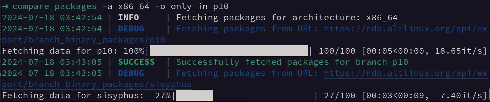

# Package Comparison Module

## Overview

The Package Comparison Module is a Python tool and CLI utility for comparing binary packages between two branches of ALT Linux: `sisyphus` and `p10`. It fetches the lists of binary packages from a public REST API, compares them, and outputs a JSON report. The report includes:
- Packages present in `p10` but not in `sisyphus`
- Packages present in `sisyphus` but not in `p10`
- Packages with higher `version-release` in `sisyphus` than in `p10`

## Features

- Fetch lists of binary packages for the `sisyphus` and `p10` branches.
- Compare the package lists and generate a JSON output with:
  - Packages only in `p10`.
  - Packages only in `sisyphus`.
  - Packages with higher `version-release` in `sisyphus` than in `p10`.

## Technology Stack

- **Python 3.10**: The programming language used for the module and CLI tool.
- **Poetry**: Dependency management and packaging tool.
- **Requests**: Library for making HTTP requests to interact with the ALT Linux API.
- **Pandas**: Data manipulation and analysis library used to handle package data.
- **Pydantic**: Data validation and settings management using Python type annotations.
- **Click**: Library for creating command-line interfaces.
- **Loguru**: Logging library for better log management.
- **TQDM**: Progress bar library for providing visual feedback during long operations.
- **Pytest**: Testing framework for writing and running tests.
- **Black**: Code formatter for maintaining code style.

## Code Structure

### src/

- **altlinux_api.py**: Module for interacting with the ALT Linux API.
- **cli.py**: Command-line interface implementation using Click for handling user input and options.
- **comparison.py**: Module for comparing package lists and generating comparison results.
- **config.py**: Configuration settings for the project.
- **logging_config.py**: Logging configuration setup using Loguru for enhanced logging capabilities.
- **models.py**: Pydantic models for data validation and structured data handling.
- **utils.py**: Utility functions used across different modules.

### tests/

- **__init__.py**: Initialization file to mark directory as a Python package.
- **test_altlinux_api.py**: Tests for the ALT Linux API interaction.
- **test_cli.py**: Tests for the CLI functionality using pytest.
- **test_comparison.py**: Tests for package comparison logic.
- **test_utils.py**: Tests for utility functions.

## Installation

1. Clone the repository:
    ```sh
    git clone git@github.com:igorkonov/package-comparison-module.git
    cd package-comparison-module
    ```

2. Install dependencies using Poetry:
    ```sh
    poetry install
    ```

## Usage

You can run the CLI utility using the following command:
```sh
poetry run compare-packages
```
You will see the following menu:


After selecting a comparison type, the tool will fetch the package data, perform the comparison, and output the result in JSON format. An example output for type 1 (Only in P10) might look like:




## Running Tests

To run the tests, use the following command:
```sh
poetry run pytest --cov=src --cov-report=html
```
This will run all the tests and generate a coverage report in HTML format.


Tests creates and overwrites the result JSON files:


Test Coverage:


## Authors

- **[igorkonov](https://github.com/igorkonov)** — project developer